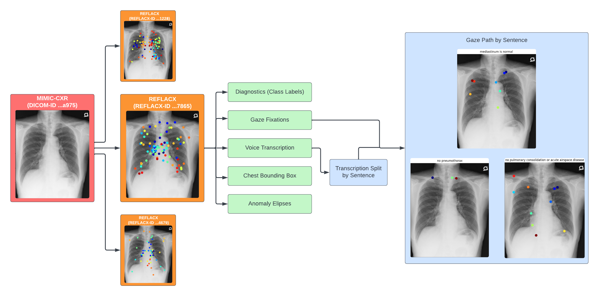
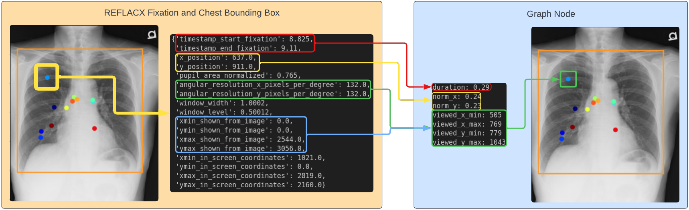
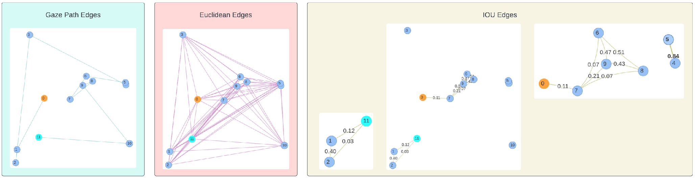

## Representando Dados do REFLACX como grafos

### Detalhamento do REFLACX

A figura abaixo ilustra a estrutura do REFLACX. Cada exame de imagem da base original (MIMIC-CXR) pode gerar várias observações, cada uma gerando um datapoint no REFLACX.
Cada ponto do REFLACX contem 5 atributos relevantes, em verde na imagem. São eles: Uma série de rótulos binários para descrever a presença de anomalias; o caminho do olhar do médico; a transcrição da voz do médico durante o processo; as coordenadas do retângulo que contem o tórax na radiografia original; e as coordenadas das elipses que contém as anomalias presentes.

O trabalho de enriquecimento de dados realizado até o momento --em azul-- foi o de dividir a transcrição em frases e, analogamente, dividir as fixações do olhar para cada uma destas frases.



O próximo passo nesta pesquisa é tratar cada um desses grupos de fixações por frase como um grafo, para que o diagnóstico das anomalias seja aprendido por uma Graph Convolutional Network(GCN).

Para facilitar o entendimento, segue uma descrição em mais detalhes a estrutura de cada fixação do olhar na base do REFLACX:
1. timestamps de início e final da fixação
2. posição (x,y) da fixação no espaço da radiografia inteira, e não da tela
3. área medida da pupila do radiologista
4. resoluções angulares, vertical e horizontal, da radiografia para o nível de zoom expecífico da fixação. Ou seja, quantos pixels são observados por grau do cone de visão do radiologista
5. métricas da janela do software de observação
6. as coordenadas do crop do exame exibido na tela no espaço da imagem inteira
7. a posição deste crop em coordenadas da tela

Para a modelagem desta estrutura de dados, descrita mais adiante, foi necessário considerar o que seria importante para um vértice, bem como nos critérios para que dois vértices sejam considerados vizinhos, partilhando uma aresta.

### Estrutura de Grafo Proposta

#### Vértices

Para o vértice em si, 3 grandezas foram consideradas relevantes: o tempo que o radiologista repousou o olhar; a posição daquela observação em relação ao tórax; e a região da imagem que se observou naquela fixação. O tempo se obtem facilmente pelo atributo 1 descrito acima. A posição relativa ao tórax pode ser obtida transformando a posição do espaço da imagem para o espaço da bounding box do torax, normalizando-a para [0,1]. Já a região da imagem considerada observada é importante para feature extraction. Seguindo o método do próprio código do REFLACX para a geração de heatmaps, a região observada em uma determinada fixação é representada por uma distribuição normal com média igual à posição da fixação e desvio padrão igual resolução angular (item 4 acima). Sendo assim, o recorte da radiografia a ser usado para representar uma fixação pode ser definido por N = número de desvios padrões que se deseja considerar.



### Feature Extraction

O modelo utilizado como feature extractor é o densenet121-res224-mimic_ch (https://github.com/mlmed/torchxrayvision, Cohen2022xrv, chexpert: irvin2019chexpert). A última camada de features, antes da planificação do tensor e sua subsequente classificação, tem dimensões 7 X 7 X 2024.


```python
import numpy as np
import matplotlib.pyplot as plot
import torch
```


```python
full_meta_path = '../reflacx_lib/full_meta.json' # if file doesn't exist, it will be created
reflacx_dir = "../data/reflacx"
mimic_dir = "../data/mimic/reflacx_imgs"

from metadata import Metadata

metadata = Metadata(reflacx_dir, mimic_dir, full_meta_path, max_dicom_lib_ram_percent=20)
```

    loading metadata
    metadata loaded from file


```python
dicom_id = '0658ad3c-b4f77a56-2ed1609f-ea71a443-d847a975'
reflacx_id = 'P109R167865'
sample = metadata.get_sample(dicom_id, reflacx_id)
```


```python
from feature_extraction.dense_feature_extraction import DenseFeatureExtractor
extractor = DenseFeatureExtractor()
```

#### Normalização pela média

Dado que o DensNet não subtrai a imagem de entrada da média das imagens da base, uma normalização pela media pode ser feita já no espaço das features.
Calculando a média das features 7x7x1024 de cada imagem do REFLACX, e usando sua subtração.


```python
avg_fpath = './avg_DensNet_REFLACX_features.npy'

try:
    avg_feats = np.load(avg_fpath)
except FileNotFoundError:
    avg_feats = extractor.get_reflacx_avg_features(metadata, True)
    np.save(avg_fpath, avg_feats)

avg_feats.shape
```


    (1024, 7, 7)


```python
print(avg_feats[0])
```

    [[-0.04179892 -0.04111027 -0.04184777 -0.04298306 -0.04277436 -0.04161398
      -0.04128559]
     [-0.0418513  -0.04231915 -0.04313573 -0.04415511 -0.04340985 -0.04202051
      -0.04093691]
     [-0.04273174 -0.04297613 -0.04256563 -0.04288057 -0.04300175 -0.04247241
      -0.04157502]
     [-0.04251337 -0.04237691 -0.04150238 -0.04181505 -0.0428514  -0.04231722
      -0.04158377]
     [-0.04263338 -0.04289535 -0.0432397  -0.04436683 -0.04437548 -0.04270092
      -0.04187388]
     [-0.04299061 -0.0445708  -0.04635097 -0.04702643 -0.04665419 -0.04469294
      -0.04295835]
     [-0.04355121 -0.04607722 -0.04779708 -0.04789687 -0.04743838 -0.04645823
      -0.045256  ]]


#### Extração propriamente dita


```python
features = extractor.get_reflacx_img_features(sample)
norm_features = extractor.get_reflacx_img_features(sample, mean_features=torch.from_numpy(avg_feats))
```


```python
features.shape, avg_feats.shape
```


    (torch.Size([1024, 7, 7]), (1024, 7, 7))


```python
print(features[0][0,:], norm_features[0][0,:])
```

    tensor([-0.0388, -0.0393, -0.0405, -0.0425, -0.0420, -0.0414, -0.0380],
           grad_fn=<SliceBackward0>) tensor([0.0030, 0.0019, 0.0014, 0.0005, 0.0008, 0.0002, 0.0032],
           grad_fn=<SliceBackward0>)


#### Feature Extraction para cada Fixation

As features acima representam a imagem inteira. Mais especificamente, cada um dos 7 X 7 tensores divide a imagem em 49 regiões e descreve cada uma delas. Existem 1024 destes tensores 7X7 para cada imagem


```python
example = features[0].tolist()
for line in example:
    for n in line:
        print("{:.3f} ".format(n), end='')
    print('\n')
```

    -0.039 -0.039 -0.040 -0.043 -0.042 -0.041 -0.038 
    
    -0.044 -0.044 -0.044 -0.045 -0.043 -0.043 -0.045 
    
    -0.044 -0.042 -0.044 -0.045 -0.042 -0.043 -0.044 
    
    -0.042 -0.043 -0.041 -0.043 -0.043 -0.043 -0.043 
    
    -0.043 -0.043 -0.042 -0.046 -0.043 -0.043 -0.040 
    
    -0.045 -0.045 -0.048 -0.050 -0.048 -0.041 -0.040 
    
    -0.044 -0.050 -0.053 -0.053 -0.052 -0.047 -0.042 
    


Se torna necessário determinar, para cada fixation e sua respectiva região de atenção, quais regiões considerar


O crop da fixation está localizado em mais de uma região (quanto mais distante for o zoom, mais regiões). Para determinar um array de features para este ponto, faz-se uma média das features de cada região que o compreende, ponderada pelas áreas correspondentes. O resultado é um tensor de 1024 X 1, do mesmo formato das features extraídas da DensNet, porém só considerando as regiões relevantes para uma fixation


```python
fixations_features = extractor.get_all_fixations_features(sample)
```


```python
fixations_features[10].shape
```


    torch.Size([1024])


#### Arestas

Já para as arestas, outras 3 medidas foram consideradas até o momento:
1. Gaze Path Edges: a posição de uma fixação na sequência de fixações do caminho do olhar. Uma fixação é vizinha da anterior e da próxima
2. Euclidean Edges: a distância euclideana entre duas observações, com peso da aresta maior para vértices mais próximos. Como cada vértice possui sua posição (x, y) normalizada para [0, 1], o peso da aresta é 2^0.5 - distância.
3. IOU edges: a similaridade entre as regiões da imagem obtidas entre duas fixações. Dois vértices podem estar próximos em distância, mas, devido a possíveis diferenças do nível de zoom a cada fixação, não possuirem muita área da imagem em comum. O peso da aresta é dado pela IOU das imagens de ambos os vértices (talvez seja interessante linearizar isso e usar sqrt(IOU))



Pode-se fazer um dataset para cada tipo de aresta, ou um único dataset, com grafos heterogêneos. É necessário cuidado neste caso, pois IOU e distâncias euclideanas possuem correlação. No momento, o treinamento inicial está sendo formulado com quatro grafos: um para cada tipo de aresta descrita acima, e um que combina arestas de IOU e Gaze Path.


### Convolução em uma GNN: Message Passing

Em uma rede em grafo, a convolução é uma operação que atualiza certas features de cada nó, agregando informações dos vizinhos. Um exemplo no caso do grafo proposto aqui, seria uma média das features extraídas para cada vértice, ponderada pelo tempo de permanência do olhar (duration). Depois de algumas camadas de convolução, o grafo é resumido usando alguma função agregadora dos vértices, como média, max, etc. Para daí, então, o grafo ser classificado como um todo.

No caso específico do REFLACX, duas questões surgem por estas agregações, tanto no nível do nó a cada convolução, quanto do grafo como um todo no final. Pelo fato das imagens serem todas radiografias de tórax alinhadas da mesma forma, as features extraídas para cada fixation não podem ser comparadas entre si com uma simples média ou soma. Features importantes na região cardíaca não necessáriamente são importantes na área do diafragma e vice-versa, por exemplo.

Por esta razão, faz-se necessário abordar este problema preservando as particularidades espaciais de cada nó, ou, pelo menos, de cada região.

A solução proposta neste momento para isso é usar as arestas de IOU para a convolução, de forma que cada nó fique restrito a receber informações com mais peso de sua vizinhança imediata. No Final de todas as camadas de convolução, pode-se dizer que cada componente conexo (rever a figura acima, extrema direita) representa uma subregião relevante da imagem, que pode ser representada, com menos perda, por uma função agregadora.

Essa abordagem geraria um novo grafo com "super-nós". Deste ponto em diante, alguma operação que preserve a espacialidade destas regiões teria que ser realizada, antes da classificação final.

### Preocupações Antecipadas

A estrutura proposta sugere alguns pontos de preocupação que devem ser estudados durante sua implementação

#### Orientação das arestas de Gaze Path
Embora a abordagem mais simples para este tipo de aresta seja considerá-la não direcionada, existe um ponto a favor de um direcionamento. Uma fixação no instante t esclarece uma questão levantada em instantes ateriores, bem como levanta questões que serão esclarecidas em instantes futuros. Portanto, pode ser que seja importante diferenciar a "ida" da "volta", ou seja: talvez o peso da aresta que levanta questões seja diferente do peso da aresta que às esclarece.
